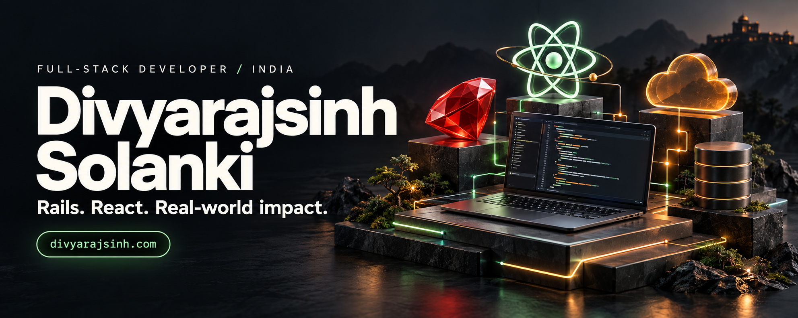
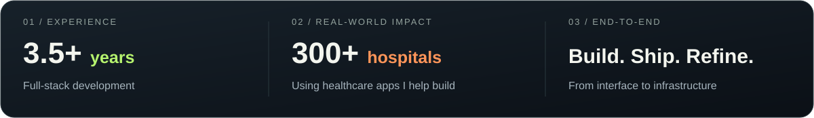
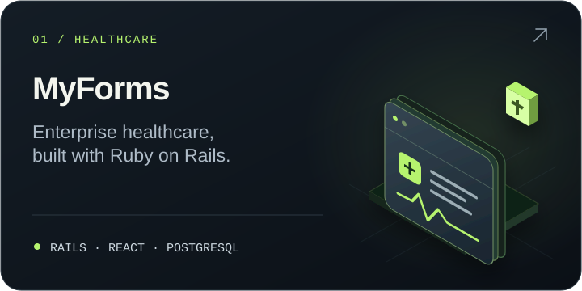
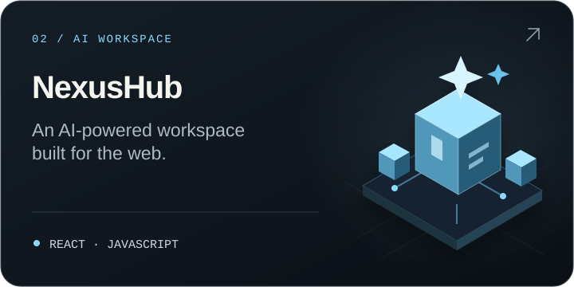
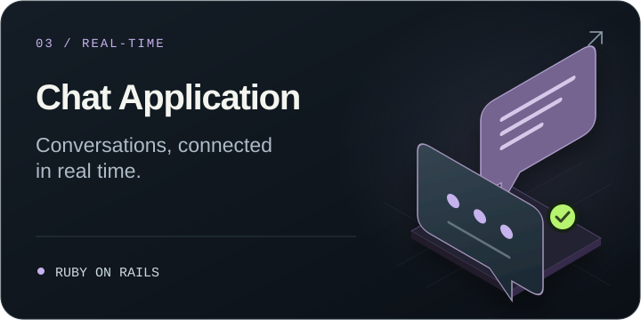
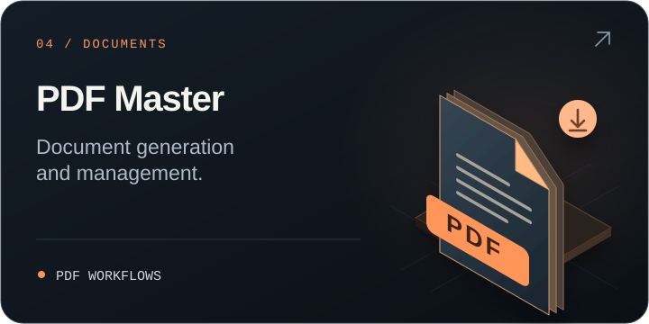
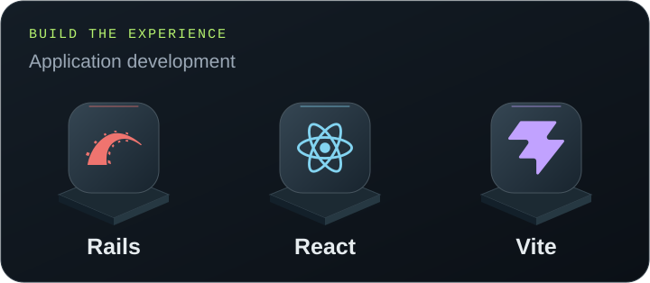
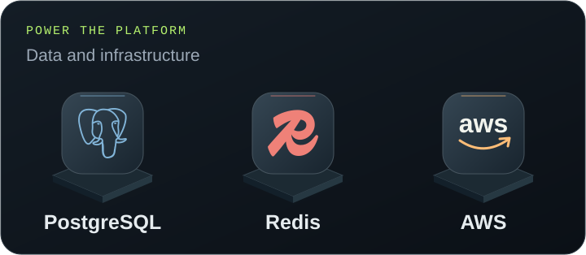

  
  
  

<strong>Full-stack developer · Ruby on Rails &amp; React · India</strong>

I turn complex problems into applications people can rely on. At **Atharva System Pvt Ltd**, I work across Rails backends, React interfaces and AWS infrastructure — including enterprise healthcare applications used by **300+ hospitals**.

<picture>
  <source media="(max-width: 600px)" srcset="./assets/impact-strip-mobile.svg" />
  
</picture>

## 01 / Selected builds

Healthcare platforms, AI workspaces, real-time conversations and document tools.

  
  
   
  
  

**[More about my work →](https://divyarajsinh.com/)**

## 02 / The toolkit

  
  

<strong>Open the full toolbox</strong>

| Layer | Technologies |
| :--- | :--- |
| **Languages** | Ruby · JavaScript · TypeScript · Python · Bash · HTML · CSS |
| **Interface** | React · Vite · Tailwind CSS · Bootstrap |
| **Backend** | Ruby on Rails · Node.js · Express · REST APIs · Sidekiq |
| **Data** | PostgreSQL · MySQL · Redis |
| **Infrastructure** | AWS · S3 · SES · SQS · Elastic Beanstalk · Docker · Linux · CI/CD |
| **Everyday tools** | Git · GitHub · VS Code · Postman |

## 03 / Behind the code

- **My focus:** Rails performance, background jobs, API integrations and scalable web applications.
- **Currently exploring:** Docker, Kubernetes and microservices.
- **Ask me about:** Rails, React, PostgreSQL, MySQL or AWS.

**[Contributions & recent activity ↗](https://github.com/Divyarajsinhsolanki?tab=overview)** &nbsp; · &nbsp; **[Browse repositories ↗](https://github.com/Divyarajsinhsolanki?tab=repositories)**

 

<a href="https://divyarajsinh.com/">
  <picture>
    <source media="(max-width: 600px)" srcset="./assets/contact-strip-mobile.svg" />
    
  </picture>
</a>

  <a href="https://divyarajsinh.com/">Portfolio</a> &nbsp; / &nbsp;
  <a href="https://linkedin.com/in/divyarajsinh-solanki-353538206">LinkedIn</a> &nbsp; / &nbsp;
  <a href="mailto:solanki.divyarajsinhp@gmail.com">solanki.divyarajsinhp@gmail.com</a>

<!-- All profile visuals are stored in this repository. No external image-card services are needed. -->
