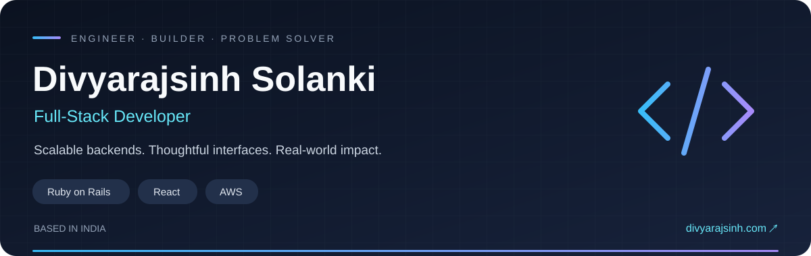

  

  <strong><a href="https://divyarajsinh.com/">Explore my portfolio ↗</a></strong>
  &nbsp; · &nbsp;
  <a href="https://linkedin.com/in/divyarajsinh-solanki-353538206">LinkedIn</a>
  &nbsp; · &nbsp;
  <a href="mailto:solanki.divyarajsinhp@gmail.com">Email me</a>

  <a href="#about">About</a> &nbsp; / &nbsp;
  <a href="#selected-work">Selected work</a> &nbsp; / &nbsp;
  <a href="#toolkit">Toolkit</a> &nbsp; / &nbsp;
  <a href="#github-activity">GitHub activity</a>

---

## About

I'm **Divyarajsinh Solanki**, a full-stack developer from India with **3.5+ years of experience**. I build web applications with **Ruby on Rails, React, Vite and AWS**, with a focus on dependable backends and clear, usable interfaces.

<table>
  <tr>
    <td width="33%" align="center"><h3>3.5+ years</h3>FULL-STACK DEVELOPMENT  </td>
    <td width="33%" align="center"><h3>300+ hospitals</h3>USING HEALTHCARE APPS I HELP BUILD  </td>
    <td width="33%" align="center"><h3>Rails → React → AWS</h3>FROM BACKEND TO DEPLOYMENT  </td>
  </tr>
</table>

- **Building:** enterprise healthcare applications, REST APIs and background job systems.
- **Focused on:** Rails performance, API integrations and scalable application architecture.
- **Exploring:** Docker, Kubernetes and microservices.
- **Happy to discuss:** Ruby on Rails, React, PostgreSQL, MySQL and AWS.

## Selected work

<table>
  <tr>
    <td width="50%" valign="top">
      <h3>01 &nbsp; MyForms</h3>
      
Enterprise healthcare platform built with Ruby on Rails.

      
<code>Rails</code> <code>React</code> <code>PostgreSQL</code> <code>Redis</code> <code>Sidekiq</code>

      
AWS infrastructure with S3, SQS and SES.

    </td>
    <td width="50%" valign="top">
      <h3>02 &nbsp; NexusHub</h3>
      
AI-powered workspace built with React and JavaScript.

      
<code>React</code> <code>JavaScript</code> <code>AI</code>

    </td>
  </tr>
  <tr>
    <td width="50%" valign="top">
      <h3>03 &nbsp; Chat Application</h3>
      
Real-time chat application built with Ruby on Rails.

      
<code>Ruby on Rails</code> <code>Real-time messaging</code>

    </td>
    <td width="50%" valign="top">
      <h3>04 &nbsp; PDF Master</h3>
      
PDF generation and management application.

      
<code>PDF generation</code> <code>Document management</code>

    </td>
  </tr>
</table>

**[Explore my work on divyarajsinh.com →](https://divyarajsinh.com/)**

## Toolkit

| Area | Technologies |
| :--- | :--- |
| **Languages** | Ruby · JavaScript · TypeScript · Python · Bash · HTML · CSS |
| **Frontend** | React · Vite · Tailwind CSS · Bootstrap |
| **Backend** | Ruby on Rails · Node.js · Express · REST APIs · Sidekiq |
| **Data** | PostgreSQL · MySQL · Redis |
| **Cloud & delivery** | AWS · S3 · SES · SQS · Elastic Beanstalk · Docker · Linux · CI/CD |
| **Developer tools** | Git · GitHub · VS Code · Postman |

## Experience

**Full Stack Developer · Atharva System Pvt Ltd**

Building enterprise applications across the stack: Rails services and REST APIs, React interfaces with Vite, and PostgreSQL/MySQL databases. My work also includes background jobs, AWS integrations and CI/CD.

## GitHub activity

  

  <a href="https://github.com/Divyarajsinhsolanki?tab=overview">Contribution calendar &amp; recent activity ↗</a>
  &nbsp; · &nbsp;
  <a href="https://github.com/Divyarajsinhsolanki?tab=repositories">Explore repositories ↗</a>
  &nbsp; · &nbsp;
  <a href="https://github.com/Divyarajsinhsolanki?tab=stars">What I'm exploring ↗</a>

<!-- The contribution calendar is available natively on the GitHub profile.
     Unavailable streak, trophy and activity-graph services were removed.
     The banner is stored in this repository; core profile content is plain HTML/Markdown. -->

---

  <strong>Let's build something useful.</strong>  
  <a href="https://divyarajsinh.com/">divyarajsinh.com</a>
  &nbsp; · &nbsp;
  <a href="mailto:solanki.divyarajsinhp@gmail.com">solanki.divyarajsinhp@gmail.com</a>

I enjoy solving complex backend problems, optimizing Rails applications, and building scalable web applications.

